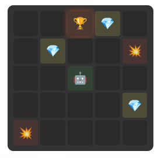
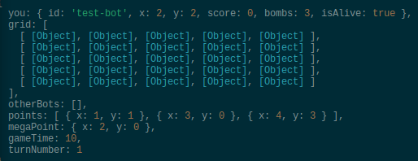
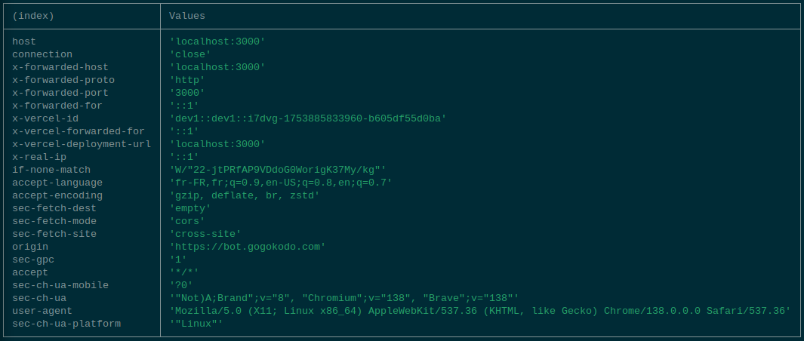
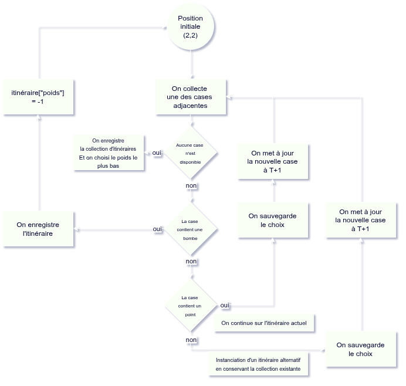

# BotWar
## Déroulement
L'application BotWar interroge notre API afin de récupérer l'action que notre bot va effectuer.

## La grille
La grille de l'exemple est une grille 5x5 de coordonnées (x, y) allant de (0, 0) à (4, 4).

Lors de la requête `GET /action`, l'API intercepte le `header x-game-state` de valeur : 
```graphql
{
    "you": {
        "id": "string",
        "x": "integer",
        "y": "integer",
        "score": "integer",
        "bombs": "integer",
        "isAlive": "boolean"
    },
    "grid": [
        [
            {
                "bots": [],
                "points": [],
                "bombs": []
            },
            {...},
            {...},
            {...},
            {...}

        ],
        [...],
        [...],
        [...],
        [...]
    ],
    "otherBots": [],
    "points": [
        {
            "x": "integer",
            "y": "integer"
        },
        {...}
    ],
        "megaPoint": {
        "x": "integer",
        "y": "integer"
    },
    "gameTime": "integer",
    "turnNumber": "integer"
}
```

## Informations pertinentes pour la v0.2
- `you` contient l'état (`coordonnées`, `score`, `bombs` et `isAlive`) de notre bot à l'instant T.
- La `grid` est la matrice(5) d'objets `JSON` contenant les informations relatives au contenu de la case (`bots`, `points`, `bombs`)

### Exemple de grille (tests)



Pour cette grille nous voyons les informations suivantes : 
- Les points sont situés aux coordonnées (1,1), (3,0), (4,3)
- Le `megaPoint` est aux coordonnées (2,0) (information indisponible dans la `grid`)



### Exemple de `header` reçu



## Refléxion
L'idée est de planifier l'itinéraire idéal en prenant en compte quelques facteurs simples pour éviter de tourner en boucle.
Les facteurs d'influences sont les suivants :
- La prochaine case contient une bombe (Dans ce cas, on recommence tout depuis zéro)
- La prochaine case contient un point (Dans ce cas, la case est à prioriser)
- La case ne contient rien (Dans ce cas, si rien de plus intéressant, on créer un embranchement et on relance la logique)

A chaque tour, plusieurs cas sont posibles :
- (1) Aucune des cases adjacentes ne contient d'item.
- (2) Au moins une des cases adjacentes contient un point.
- (3) Au moins une des cases adjacentes contient une bombe.

- Dans le cas (1), on exécute la fonction sur l'ensemble des cases adjacentes à t+1 (on donne du poids au meilleur itinéraire)
- Dans le cas (2), on exécute la fonction une nouvelle fois en prenant les coordonnées de la case du point pour s'assurer qu'au moins une case à t+1 permettra d'effectuer un nouveau coup.
- Dans le cas (3), on exécute la fonction sur le case ne contenant pas de bombe à t+1

Un itinéraire est caractérisé par :
- un poids (plus la valeur est basse, mieux c'est)
- une collection de mouvements

Le poids est calculé de la façon suivante :
- Si le bot avance sur une case vide, on incrémente de 1.
- Si le bot avance sur une case "point" on n'ajoute rien, si "megaPoint on retire 1.
- Si le bot avance sur une case "bombe" on réinitialise le poids à 0 et on recommence tout.




Le schéma sera ammené à évoluer