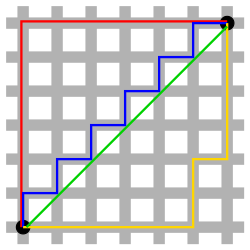
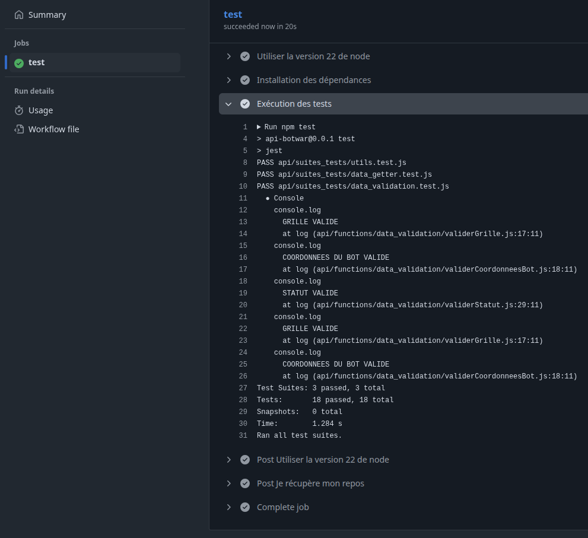

# BotWar
## Déroulement
L'application BotWar interroge notre API afin de récupérer l'action que notre bot va effectuer.

## La grille
La grille de l'exemple est une grille 5x5 de coordonnées (x, y) allant de (0, 0) à (4, 4).

Lors de la requête `GET /action`, l'API intercepte le `header x-game-state` de valeur : 
```graphql
{
    "you": {
        "id": "string",
        "x": "integer",
        "y": "integer",
        "score": "integer",
        "bombs": "integer",
        "isAlive": "boolean"
    },
    "grid": [
        [
            {
                "bots": [],
                "points": [],
                "bombs": []
            },
            {...},
            {...},
            {...},
            {...}

        ],
        [...],
        [...],
        [...],
        [...]
    ],
    "otherBots": [],
    "points": [
        {
            "x": "integer",
            "y": "integer"
        },
        {...}
    ],
        "megaPoint": {
        "x": "integer",
        "y": "integer"
    },
    "gameTime": "integer",
    "turnNumber": "integer"
}
```

## Informations pertinentes pour la v0.2
- `you` contient l'état (`coordonnées`, `score`, `bombs` et `isAlive`) de notre bot à l'instant T.
- La `grid` est la matrice(5) d'objets `JSON` contenant les informations relatives au contenu de la case (`bots`, `points`, `bombs`)

### Exemple de grille (tests)


Pour cette grille nous voyons les informations suivantes : 
- Les points sont situés aux coordonnées (1,1), (3,0), (4,3)
- Le `megaPoint` est aux coordonnées (2,0) (information indisponible dans la `grid`)


### Exemple de `header` reçu


## Refléxion
L'idée est de planifier l'itinéraire idéal en prenant en compte quelques facteurs simples pour éviter de tourner en boucle.
Les facteurs d'influences sont les suivants :
- La prochaine case contient une bombe (Dans ce cas, on recommence tout depuis zéro)
- La prochaine case contient un point (Dans ce cas, la case est à prioriser)
- La case ne contient rien (Dans ce cas, si rien de plus intéressant, on créer un embranchement et on relance la logique)

A chaque tour, plusieurs cas sont posibles :
- (1) Aucune des cases adjacentes ne contient d'item.
- (2) Au moins une des cases adjacentes contient un point.
- (3) Au moins une des cases adjacentes contient une bombe.

- Dans le cas (1), on exécute la fonction sur l'ensemble des cases adjacentes à t+1 (on donne du poids au meilleur itinéraire)
- Dans le cas (2), on exécute la fonction une nouvelle fois en prenant les coordonnées de la case du point pour s'assurer qu'au moins une case à t+1 permettra d'effectuer un nouveau coup.
- Dans le cas (3), on exécute la fonction sur le case ne contenant pas de bombe à t+1

Un itinéraire est caractérisé par :
- un poids (plus la valeur est basse, mieux c'est)
- une collection de mouvements

Le poids est calculé de la façon suivante :
- Si le bot avance sur une case vide, on incrémente de 1.
- Si le bot avance sur une case "point" on n'ajoute rien, si "megaPoint on retire 1.
- Si le bot avance sur une case "bombe" on réinitialise le poids à 0 et on recommence tout.


Le schéma sera ammené à évoluer

___ 

Le calcul de la distance entre deux points sera géré avec la [méthode Manhattan](https://fr.wikipedia.org/wiki/Distance_de_Manhattan) qui permet de définir le nombre de déplacements entre deux points d'un plan 2D. (bleu, rouge & jaune)



$ d(a, b) = ∣Xb−Xa∣+∣Yb−Ya∣ $

### Récupérer le détail de la grille
En récupérant le header X-Game-State, voici l'aggrégation que l'on peut obtenir avant la planification de l'itinéraire

```bash
## Détail des cellules de la grille
┌─────────┬───┬───┬───────┬───────┬───────┬─────────────┬───────────┐
│ (index) │ x │ y │ bot   │ point │ bomb  │ positionBot │ megaPoint │
├─────────┼───┼───┼───────┼───────┼───────┼─────────────┼───────────┤
│ 0       │ 0 │ 0 │ false │ false │ false │ false       │ false     │
│ 1       │ 1 │ 0 │ false │ false │ false │ false       │ false     │
│ 2       │ 2 │ 0 │ false │ false │ false │ false       │ true      │
│ 3       │ 3 │ 0 │ false │ true  │ false │ false       │ false     │
│ 4       │ 4 │ 0 │ false │ false │ false │ false       │ false     │
│ 5       │ 0 │ 1 │ false │ false │ false │ false       │ false     │
│ 6       │ 1 │ 1 │ false │ true  │ false │ false       │ false     │
│ 7       │ 2 │ 1 │ false │ false │ false │ false       │ false     │
│ 8       │ 3 │ 1 │ false │ false │ false │ false       │ false     │
│ 9       │ 4 │ 1 │ false │ false │ true  │ false       │ false     │
│ 10      │ 0 │ 2 │ false │ false │ false │ false       │ false     │
│ 11      │ 1 │ 2 │ false │ false │ false │ false       │ false     │
│ 12      │ 2 │ 2 │ false │ false │ false │ true        │ false     │
│ 13      │ 3 │ 2 │ false │ false │ false │ false       │ false     │
│ 14      │ 4 │ 2 │ false │ false │ false │ false       │ false     │
│ 15      │ 0 │ 3 │ false │ false │ false │ false       │ false     │
│ 16      │ 1 │ 3 │ false │ false │ false │ false       │ false     │
│ 17      │ 2 │ 3 │ false │ false │ false │ false       │ false     │
│ 18      │ 3 │ 3 │ false │ false │ false │ false       │ false     │
│ 19      │ 4 │ 3 │ false │ true  │ false │ false       │ false     │
│ 20      │ 0 │ 4 │ false │ false │ true  │ false       │ false     │
│ 21      │ 1 │ 4 │ false │ false │ false │ false       │ false     │
│ 22      │ 2 │ 4 │ false │ false │ false │ false       │ false     │
│ 23      │ 3 │ 4 │ false │ false │ false │ false       │ false     │
│ 24      │ 4 │ 4 │ false │ false │ false │ false       │ false     │
└─────────┴───┴───┴───────┴───────┴───────┴─────────────┴───────────┘
## Cases à points
┌─────────┬───┬───┬─────┬───────┬──────┬─────────────┬───────────┐
│ (index) │ x │ y │ bot │ point │ bomb │ positionBot │ megaPoint │
├─────────┼───┼───┼─────┼───────┼──────┼─────────────┼───────────┤
│ 0       │ 2 │ 0 │ 0   │ 0     │ 0    │ 0           │ 1         │
│ 1       │ 3 │ 0 │ 0   │ 1     │ 0    │ 0           │ 0         │
│ 2       │ 1 │ 1 │ 0   │ 1     │ 0    │ 0           │ 0         │
│ 3       │ 4 │ 3 │ 0   │ 1     │ 0    │ 0           │ 0         │
└─────────┴───┴───┴─────┴───────┴──────┴─────────────┴───────────┘
## Cases à bombes
┌─────────┬───┬───┬─────┬───────┬──────┬─────────────┬───────────┐
│ (index) │ x │ y │ bot │ point │ bomb │ positionBot │ megaPoint │
├─────────┼───┼───┼─────┼───────┼──────┼─────────────┼───────────┤
│ 0       │ 4 │ 1 │ 0   │ 0     │ 1    │ 0           │ 0         │
│ 1       │ 0 │ 4 │ 0   │ 0     │ 1    │ 0           │ 0         │
└─────────┴───┴───┴─────┴───────┴──────┴─────────────┴───────────┘
## Position du bot à l'instant (t)
┌─────────┬───┬───┬─────┬───────┬──────┬─────────────┬───────────┐
│ (index) │ x │ y │ bot │ point │ bomb │ positionBot │ megaPoint │
├─────────┼───┼───┼─────┼───────┼──────┼─────────────┼───────────┤
│ 0       │ 2 │ 2 │ 0   │ 0     │ 0    │ 1           │ 0         │
└─────────┴───┴───┴─────┴───────┴──────┴─────────────┴───────────┘

```
## Une fois ces tableaux obtenus

1. On trouve le point le plus proche
2. On dirige le bot tour par tour jusqu'à ce point
3. Si la case suivante contient une bombe :
    - On utilise l'axe perpendiculaire pour choisir entre l'une des deux options (si je vais vers le haut, et qu'une bombe se trouve sur le chemin, il faudra impérativement tourner à droit ou à gauche)
    - avant de tourner, on vérifie que la case est accessible
    - si aucune case n'est accessible, on fait demi tour

```bash
## Distance Manhattan
┌─────────┬────────────────┬─────────────┬──────────┐
│ (index) │ coordonnees    │ type        │ distance │
├─────────┼────────────────┼─────────────┼──────────┤
│ 0       │ { x: 2, y: 0 } │ 'megaPoint' │ 2        │
│ 1       │ { x: 3, y: 0 } │ 'point'     │ 3        │
│ 2       │ { x: 1, y: 1 } │ 'point'     │ 2        │
│ 3       │ { x: 4, y: 3 } │ 'point'     │ 3        │
└─────────┴────────────────┴─────────────┴──────────┘
```

Je choisi l'élement le plus proche => Element(x: 2, y: 0)
Je récupère la position du bot => Bot(x: 2, y: 2)

Les mouvements pour y arriver sont : 
Mouvement(B(x)-E(x), B(y)-E(y)) => (0, 2)

Soit, 2 cases vers le haut.


## Tests en continu
Tous les tests sont automatiquement exécutés à chaque `push` sur n'importe quelle branche

